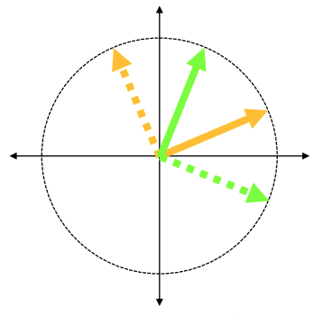

# DEFCON 2021 Quals: Back to QOO

`crytpo`  `reverse`

This challenge is about quantum computing + cryptography. It is a follow-up on [QOO or OOO](https://github.com/o-o-overflow/dc2021q-qoo-or-ooo).

## Run the challenge

Type

```bash
./service.py
```

The script is under `service/src/`. You will need package `pycryptodome` and `qunetsim`.

## Description

This challenge has two steps. In the first step, you need to win the game with [zardus](https://twitter.com/Zardus). You guys need to compete with two QOO team members. As described in `game.py`, you and zardus will bet on two binary numbers, say x and y. Your competitors will also bet on two binary numbers, say a and b. To win the game, you and zardus's numbers need to satisfy:

```
x + y = a * b
```

You need to repeatly play this game for 128 times and win more than 85% of the game.

```python
    def run(self):
        print(f"[Round {self.id}]: Your competitor bets on {self.competitor_bet1}")
        print(OPTIONS)
        selection = input().strip()
        if selection == COIN:
            print(COIN_ROTATE)
            selection = input().strip()
            if selection == LEFT:
                self.coin.rotate_left()
            elif selection == RIGHT:
                self.coin.rotate_right()
            elif selection != NOT_CHANGE:
                return self.error()
            player1_bet = self.coin.flip()  # Just clean it up. Not a hint.
        elif selection == ZERO:
            player1_bet = 0
        elif selection == ONE:
            player1_bet = 1
        else:
            return self.error()

        print(f"[Round {self.id}]: zardus's competitor bets on {self.competitor_bet2}, " +
                f"you bet on {player1_bet}")
        return self.play(player1_bet, self.player2_bet)
```


When you decide on your `x`, you only know your competitor's number `a`. You can choose to play 0, 1, or use a magic coin. After your bet, you will know the other competitor's bet and whether you and zardus win or lose the game.


If you win more than 85% of the game, zardus will send you the chat between him and [adamd](https://twitter.com/adamdoupe). You will see messages like such:

```
zardus receives from adamd: 0:0
zardus receives from adamd: 1:0
zardus receives from adamd: 2:0
...
zardus receives from adamd: -1:1fbc40ed0426a2ff4fa659db26a0f7f3
zardus receives from adamd: -2:7c4cfe551ce75e26454b7d9f8b5fe1f8e2a653af2caa56a2f70936f69019ddf23b09fec90cc9506531d460
```

And the key was encrypted in the message.

## Solution

### Win the game

This game is the famous quantum xor game (aka [CHSH game](https://www.youtube.com/watch?v=1nh-pjxnM4I)). In this game, if you and your partner acts independently (they do not decide on a strategy before the game starts), then your success probability will be 50%. If you and your partner communicate the strategy before the game starts, no matter the strategy is pure-strategy (e.g., if the competitor plays 0, then you will play 1) or mixed strategy (e.g., if the competitor plays 0, then by probably 25% you will play 1), you and your partner will win <= 75% of the game. However, if you and your partner hold entangled qubits (aka EPR pair), then you guys will have a winning rate cos(pi / 8) >= 85%.

Therefore, to win 85% game, you need to use your qubits which are encoded as magic coins (see `coin.py`). Also, now you can infer that your qubits and zardus's qubits must be entangled --- that's how you can get 85% winning rate.

How to use your magic coin? Rotating left or right is associated with the measurement basis. In this challenge, when your competitor bets on 0, you should rotate your coin left --- meaning that you will measure the qubit in the green basis. If you competitor bets on 1, you should rorate right, which means that you will measure the qubit in the orange basis.





### Encrypt the message

Message `i:b` comes from adamd, in class `Adamd`, function `chat()`:

```python
        while q_i < qubits_n:
            qubit = self.host.get_data_qubit(zardus_id, wait=self.wait_time)
            while qubit is None:
                qubit = self.host.get_data_qubit(zardus_id, wait=self.wait_time)
            basis = random.randint(0, 1)
            self.host.send_classical(zardus_id, f"{q_i}:{basis}", await_ack=True)
            msg = self.get_next_classical_message(zardus_id, msg_buff, q_i)
            if msg == f"{q_i}:0":
                if basis == 1:
                    qubit.H()
                bit = qubit.measure(non_destructive=True)
                secret_key.append(bit)
            q_i += 1
```

zardus and adamd are communiting by bb84 protocol. I found this very helpful when I learned [bb84](https://devel0pment.de/?p=1533#qkd1).

The message sent with non-negative indices are the bases adamd uses. The bases zardus uses are the same as the competitor's number in the game (see function `chat()`, class `Alice`):
```python
            if message == f"{q_i}:{self.bases[q_i]}":
                ....
```

All you need to do is to compare the competitor's number with adamd's basis. For those with the same basis, you wanna keep the qubit's measurement --- which is zardus's bet in the game! And you can easily get it. Just calculate `y` by `x`, `a`, and `b`, and equation `x + y = a * b`.

## Run the exploit

To run the exploit, simply put

```
./exploit.py
```

in `interaction/`. It will automatially call `service.py` at `../service/src/service.py`

## If you wanna see the actual circuit

All credit to [plonk](https://twitter.com/p1onk)

[You should see this](
https://algassert.com/quirk#circuit=%7B%22cols%22:%5B%5B1,1,1,%7B%22id%22:%22X%5Eft%22,%22arg%22:%22atan(ln(pi%20t))%22%7D%5D,%5B%5D,%5B%5D,%5B%22Measure%22,%22Measure%22,1,%22Y%5Eft%22%5D,%5B%5D,%5B%22%E2%80%A2%22,1,%22H%22%5D,%5B1,1,%22Measure%22%5D,%5B1,%22%E2%97%A6%22,1,%22Y%5E%C2%BC%22%5D,%5B1,%22%E2%80%A2%22,1,%22Y%5E-%C2%BC%22%5D,%5B1,1,1,%22Measure%22%5D,%5B%22Chance4%22%5D,%5B%22%E2%80%A2%22,%22%E2%80%A2%22,1,1,%22X%22%5D,%5B1,1,%22%E2%80%A2%22,%22%E2%97%A6%22,%22X%22%5D,%5B1,1,1,1,%22X%22%5D,%5B%22Amps4%22%5D,%5B%5D,%5B%5D,%5B%5D,%5B1,1,1,1,%22ZDetector%22%5D%5D,%22init%22:%5B%22-%22,%22-%22,%22-%22,1%5D%7D)
